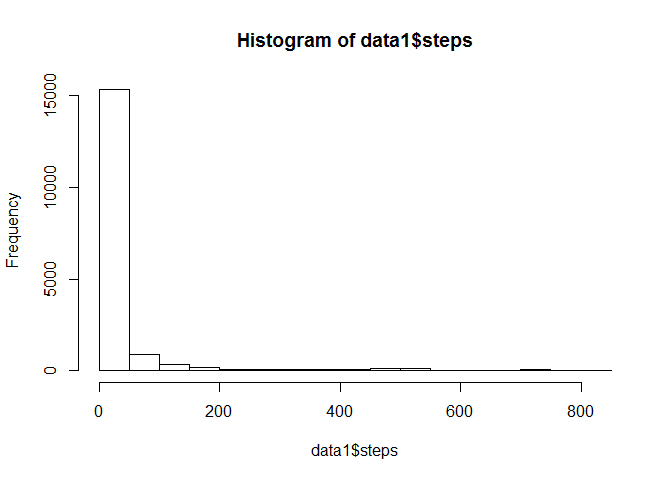

# Reproducible Research: Peer Assessment 1

## Loading and preprocessing the data

```r
# Read file "activity.csv"
data <- read.csv("activity.csv")
# Convert factor data$date to a date format
data$date <- as.Date(data$date, format="%Y-%m-%d")
```

## What is mean total number of steps taken per day?

```r
# Construct new data.frame with ommitted NA values
newdata <- na.omit(data)

# Plot Histogram
hist(newdata$steps)
```

 

```r
# calculate mean & median
var_mean = mean(newdata$steps)
var_median = median(newdata$steps)
```

Mean steps taken per day is: 37.3826.   
Median of total steps      : 0.


## What is the average daily activity pattern?

```r
# Construct new dataframe of average steps in each interval
int <- as.data.frame(unique(newdata$interval))
names(int)<-"interval"
patt <- as.data.frame(matrix(0, ncol = 2, nrow = nrow(int)))
patt$V2 <- int$interval
for (i in 1:nrow(int)) {
  patt[i,1] <- mean(newdata$steps[newdata$interval == int[i,1]])
}

# Plot average steps in each interval
plot(patt$V2, patt$V1,type="l")
```

 

```r
# Find interval that has highest number of steps
high_steps <- patt$V2[which.max(patt$V2)]
```

The interval that contains the maximum number of steps is 2355


## Imputing missing values

```r
# Replace all NA with average number of steps for that day
sum(is.na(data$steps))
```

```
## [1] 2304
```

```r
data1 <- data
temp <- tapply(data$steps, data$date, mean, simplify=T)
temp <- subset(temp, !is.na(temp))
# If still NA, then replace with average number of steps overall
mean_list <- mean(!is.na(data1$steps))
data1[is.na(data1$steps),1] <- mean_list

# Plot histogram on the number of steps with imputed values
hist(data1$steps)
```

 

```r
# Calculate mean and median on the # of steps
var2_mean <- mean(data1$steps)
var2_median <- median(data1$steps)
```

Mean steps taken per day is: 32.5939.   
Median of total steps      : 0.

## Are there differences in activity patterns between weekdays and weekends?

```r
# Create a new variable to determine weekday or weekend
data$day <- "weekday"
data$day[weekdays(data$date) %in% c("Saturday", "Sunday")] <- "weekend"

# Create 2 new dataframe consisting of either weekday or weekend
weekday <- subset(data, day == "weekday")
weekend <- subset(data, day == "weekend")

# Average number of steps for each internval for the two dataframes
avg_weekday <- tapply(weekday$steps, weekday$interval, mean, na.rm= TRUE)
avg_weekend <- tapply(weekend$steps, weekend$interval, mean, na.rm= TRUE)

# Plot results
par(mfrow=c(2,1))
plot(avg_weekday, type="l")
plot(avg_weekend, type="l")
```

 

